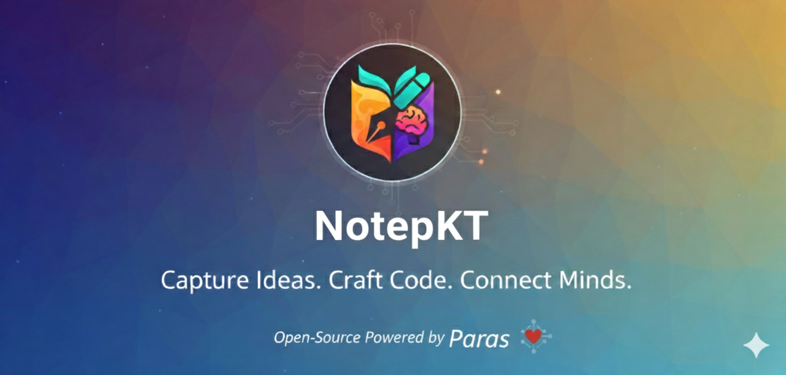

# 📝 NotyKT

A complete Kotlin-stack application for taking notes, built to demonstrate modern development practices using **Ktor**, **PostgreSQL**, **Docker**, and **Jetpack Compose**.

---

## 📦 Project Structure

This project is divided into two parts:

- **NotyKT Backend**: A REST API built with Ktor and PostgreSQL for data storage.
- **NotyKT Frontend**: An Android application built with Jetpack Compose for the user interface.

---


## ✅ Prerequisites

- **Java Development Kit (JDK) 21**
- **Docker**: Required to run the PostgreSQL database.
- **IntelliJ IDEA**: For developing the Ktor backend.
- **Android Studio**: For developing the Jetpack Compose frontend.

---

## 📱 NotyKT Frontend: Android App with Jetpack Compose

The frontend is a native Android application built with Jetpack Compose. It provides a clean and intuitive user interface for interacting with the backend API.

### 🏛️ Architecture: MVVM Pattern

The project is organized under the package `com.example.notepkt` with the following structure:

### 🖼️ UI and Screens

The app uses a navigation controller to switch between:

- **Login/Sign-up Screen** (`LoginScreen.kt`, `SignupScreen.kt`)
- **Notes List Screen** (`NoteScreen.kt`)
- **Create Note Screen** (integrated in `NoteScreen.kt` or separate)

### 📚 Key Libraries

- **Jetpack Compose** – Declarative UI toolkit
- **Ktor Client** – HTTP client for API calls
- **Kotlinx Serialization** – JSON serialization/deserialization

---

## 💻 NotyKT Backend: Ktor REST API

The backend is a secure and scalable REST API built with Ktor. It handles all data persistence, authentication, and business logic.


### 🔗 API Endpoints

| Method | Endpoint        | Description                                |
|--------|------------------|--------------------------------------------|
| POST   | `/signup`        | Creates a new user with email and password |
| POST   | `/login`         | Authenticates user and returns JWT         |
| GET    | `/notes`         | Retrieves all notes for the user           |
| POST   | `/notes`         | Creates a new note                         |
| PUT    | `/notes/{id}`    | Updates an existing note                   |
| DELETE | `/notes/{id}`    | Deletes a specific note                    |

---

## 🔒 Database & Security

- **PostgreSQL**: Runs in Docker, stores users and notes.
- **BCrypt**: Passwords are securely hashed before storage.

---

## 🚀 Getting Started

Follow these steps to set up and run the full-stack application on your local machine.

---
## 🐳 Step 1: Set up the Database with Docker

1. **Install Docker**: If you don't have Docker Desktop, download and install it.

2. **Run the PostgreSQL container**:

   ```bash
   docker run --name my-postgres -e POSTGRES_PASSWORD=paras@2005 -e TZ=UTC -p 5432:5432 -d postgres 
    ```
# Connect to the database
docker exec -it my-postgres psql -U postgres

# Inside the psql shell, run these commands:
  ```bash
CREATE DATABASE notep;
\c notep
CREATE TABLE users (
    id SERIAL PRIMARY KEY,
    google_id VARCHAR(255) UNIQUE NOT NULL,
    name VARCHAR(255) NOT NULL,
    email VARCHAR(255) NOT NULL
);
CREATE TABLE notes (
    id SERIAL PRIMARY KEY,
    user_id INT NOT NULL,
    title VARCHAR(255) NOT NULL,
    content VARCHAR(1024) NOT NULL,
    timestamp BIGINT NOT NULL,
    FOREIGN KEY (user_id) REFERENCES users(id) ON DELETE CASCADE
);
# To exit psql, type \q
  ```
## 🔑 Step 2: Configure Authentication

You need to get two different Client IDs from a single Google Cloud project to handle authentication.

1. Go to **Google Cloud Console > APIs & Services > Credentials**.

2. Create the following OAuth 2.0 Client IDs:

   - **Web Application Client ID**:
     - Purpose: Used by the Ktor backend
     - Location: Paste into `GOOGLE_CLIENT_ID` in `Routing.kt`

   - **Android Client ID**:
     - Purpose: Used by the Jetpack Compose mobile app
     - Location: Paste into `GOOGLE_CLIENT_ID` in `MainActivity.kt`

---

## 💻 Step 3: Run the Ktor Backend

1. Open the backend project in **IntelliJ IDEA**.

2. Run the `Application.kt` file.

3. The console should confirm the server is running at:
```bash
http://localhost:8080
```

---

## 📱 Step 4: Run the Jetpack Compose Frontend

1. Open the frontend project in **Android Studio**.

2. Run the app on an emulator or a physical device.

3. The app will launch, allowing users to **sign up or log in** to access their notes.

---
## 📄 License

This project is open-source and available under the MIT License.

---

## 🙌 Contribution

Feel free to fork the repo, submit pull requests, or open issues to improve the project. Whether it's UI polish, backend enhancements, or documentation—every bit helps!
